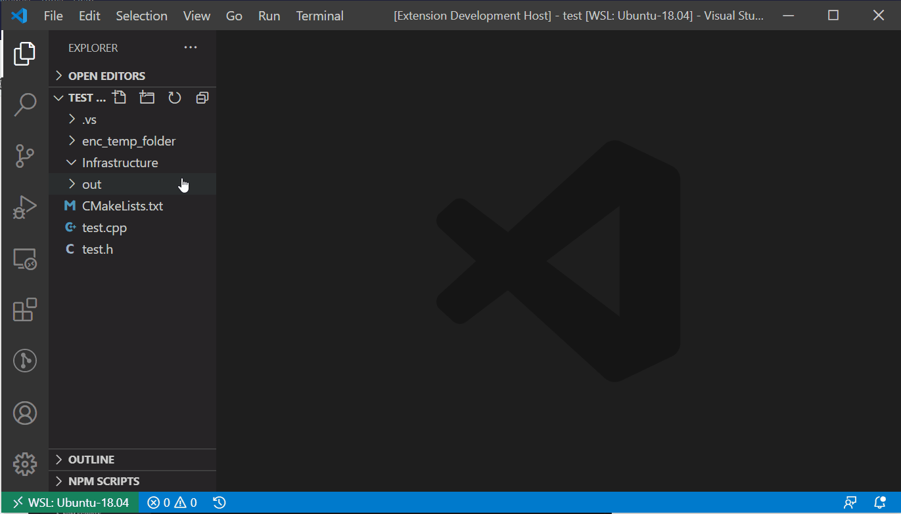

# cpp-assist

Tool to help you in your C++ development

Tools:
- [cpp-assist](#cpp-assist)
  - [Add a new class to folder](#add-a-new-class-to-folder)
  - [Insert an include guard to current H file](#insert-an-include-guard-to-current-h-file)
  - [Insert an `#include` instruction](#insert-an-include-instruction)
  - [Settings](#settings)
  - [Future planned features](#future-planned-features)

**Note:** If you find a bug, please do not give a bad review. Instead just open an issue. I promise to do my best.

---
## Add a new class to folder
Right click a folder in the Explorer and select `c++ assist: create class`. Fill the class name and press `Enter`. The new class will be created in files containing the class name with extensions of your selection (determined in the [settings](#settings)).


## Insert an include guard to current H file
ctrl-shift-p and run command: `c++ assist: include guard`
You can use keyboard shortcut: alt-ctrl-g

If the relative path file is `src/moon/dark/side.h`, than the include guard will be:
```c
#ifndef __MOON_DARK_SIDE__
#define __MOON_DARK_SIDE__

#endif  /* __MOON_DARK_SIDE__ */
```
The 'prefix' option and 'suffix' option (both  default: "\_\_") together with what to ignore before the path 'Remove Path Until' option. Empty makes the path from the workspace root.

## Insert an `#include` instruction
Copy header file path (right click the tab or the file in explorer and select 'Copy Path'). Go to the file which is supposed to include it (implementation or header file). 
Do: `ctrl-shift-p` and run command: `c++ assist: include file`
You can use keyboard shortcut: `alt-ctrl-i`
What to ignore before the 'Remove Path Until' option. Set as blank if you want it relative to the workspace root. If option 'Is relative' is set (default: yes), than the path will be relative to current file.

Before (absolute path):
```cpp
#include "algebra/matrix/matrix.h"
/home/ronny/workspaces/project/src/maker/sphere.h
#include "graphics/gri/gl.h"
```
After:
```cpp
#include "algebra/matrix/matrix.h"
#include "maker/sphere.h"
#include "graphics/gri/gl.h"
```
Or (relative path):
```cpp
#include "algebra/matrix/matrix.h"
#include "../maker/sphere.h"
#include "graphics/gri/gl.h"
```

## Settings
* Remove Path Until - Ignore this path prefix from `include` path. If empty, it will ignore the path of current workspace.
* Is Relative - Is include path relative to current position or absolute from current workspace root. (default: true)
* Random - Should we add a random string to file name string in the include guard? (default: true)
* Prefix - Prefix for include guard. (default: '__')
* Suffix - Suffix for include guard. (default: '__')
* Comment Style - Style of comment in include guard end. (block/line/none - default: line)
* Spaces Before Comment - How many spaces between the `#endif` and the comment in the end of include guard. (default: 2)
* Cpp Extension - Extension of C++ implementation file (cpp/c++/cc). (default: cpp)
* Hpp Extension - Extension of C++ header file (h/hpp/h++/hh). (default: h)
* Cpp Template - Path of template of C++ implementation file. (default: '' - meaning: use default template)
* Hpp Template - Path of template of C++ header file. (default: '' - meaning: use default template)
* Use Include Guard - Add include guard to the header file when creating a class. (default: true)
        
## Future planned features
1. Insert include instruction of a keyword by finding keyword declaration.
